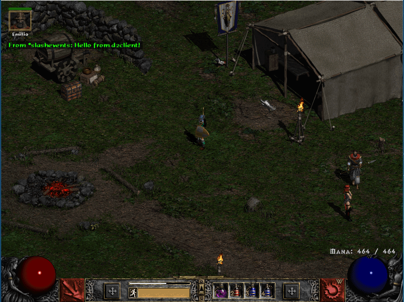

# Diablo II TCP client
[](https://goreportcard.com/report/github.com/nokka/d2client)
[](https://godoc.org/github.com/nokka/d2client)

D2Client is a TCP client that logs into the [Diablo II](http://eu.blizzard.com/en-gb/games/d2/)  server and can then write messages to the server, both in the chat and whisper specific accounts.



## Install

```bash
$ go get github.com/nokka/d2client
```

## Usage

```go
package main

import (
	"fmt"
	"log"

	"github.com/nokka/d2client"
)

func main() {
	client := d2client.New()
	client.Open("private.server:3001")
	defer client.Close()

	// Setup channel to read on.
	ch := make(chan []byte)

	// Setup output error channel.
	errors := make(chan error)

	client.Read(ch, errors)

	err := client.Login("user", "password")
	if err != nil {
		log.Fatal(err)
	}

	client.Whisper("nokka", "Hello!")


	// Read the output from the chat onto a channel.
	for {
		select {
		// This case means we recieved data on the connection.
		case data := <-ch:
			fmt.Println(string(data))

		case err := <-errors:
			fmt.Println(err)
			break
		}
	}
}
```

## Contributing

Please see [CONTRIBUTING.md](/CONTRIBUTING.md).